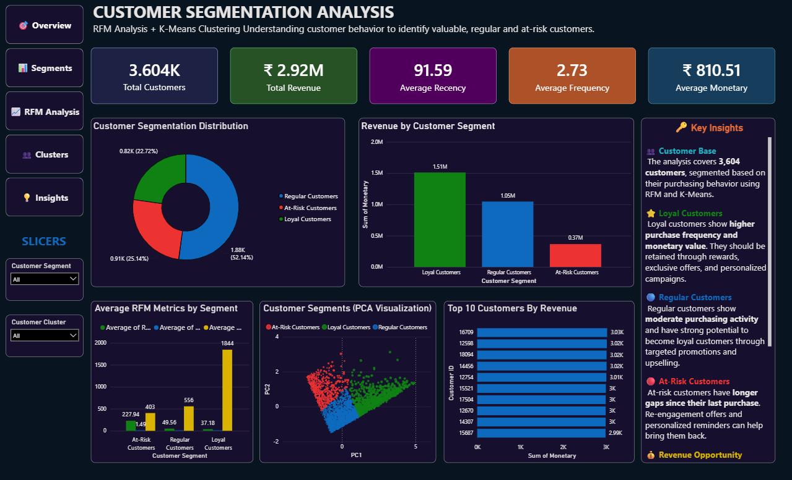
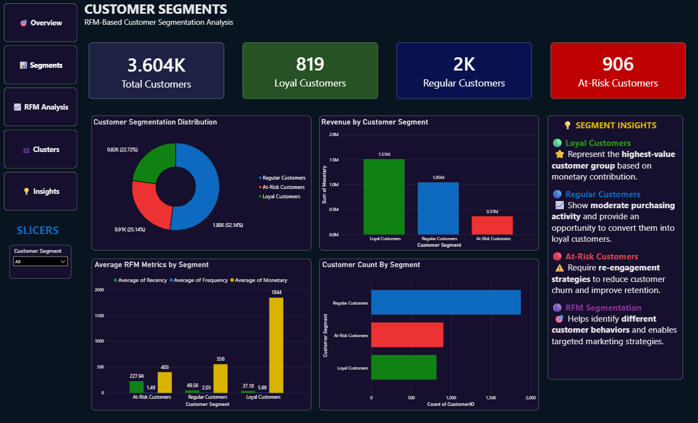
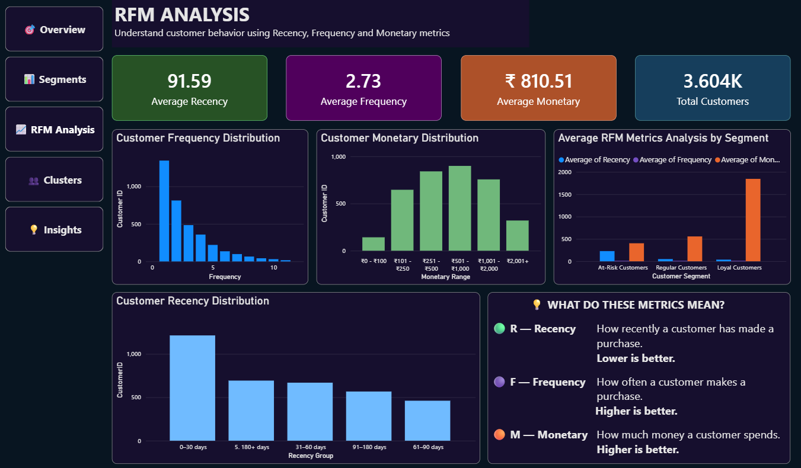
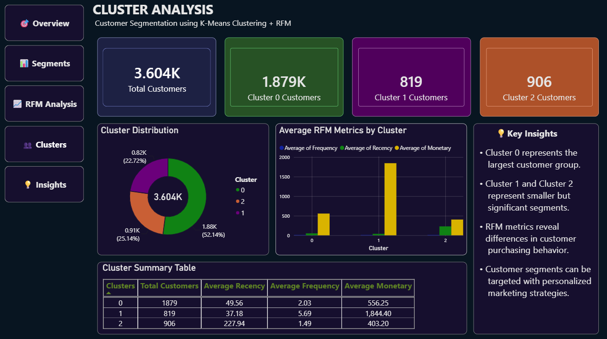
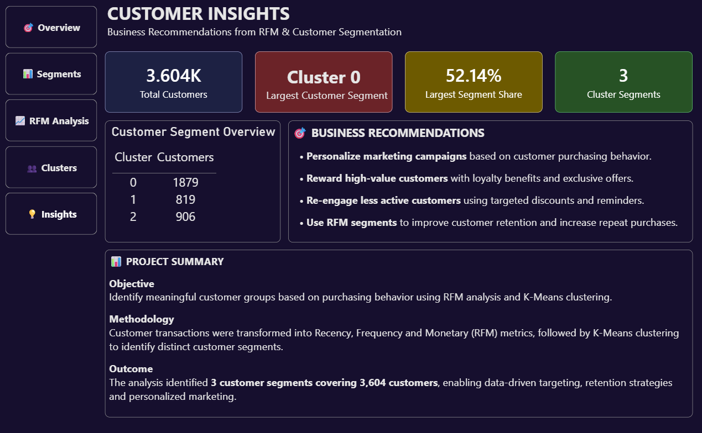

# Customer Segmentation using RFM Analysis and K-Means

## 📌 Project Overview

This project focuses on customer segmentation using Recency, Frequency, and Monetary (RFM) analysis combined with K-Means clustering.

The objective is to identify meaningful customer groups based on purchasing behavior and provide data-driven insights for targeted marketing and customer retention.

## 🛠️ Tools & Technologies

- Python
- Pandas
- NumPy
- Matplotlib
- Seaborn
- Scikit-learn
- RFM Analysis
- K-Means Clustering
- Power BI
- Jupyter Notebook

## 📊 Project Workflow

1. Data Collection
2. Data Cleaning
3. Exploratory Data Analysis
4. RFM Analysis
5. Feature Preparation
6. K-Means Clustering
7. Cluster Evaluation using Silhouette Score
8. Customer Segmentation
9. Power BI Dashboard
10. Business Insights

## 📈 RFM Analysis

The customers were analyzed using:

- **Recency** – How recently a customer made a purchase
- **Frequency** – How often a customer made purchases
- **Monetary** – How much a customer spent

## 🤖 K-Means Clustering

K-Means clustering was used to group customers based on their RFM characteristics.

The analysis identified **3 customer clusters**.

## 📊 Dashboard

The Power BI dashboard contains:

- Overview
- Customer Segments
- RFM Analysis
- Cluster Analysis
- Business Insights

## 👥 Customer Distribution

| Cluster | Customers |
|---|---:|
| Cluster 0 | 1,879 |
| Cluster 1 | 819 |
| Cluster 2 | 906 |
| **Total** | **3,604** |

## 📊 Power BI Dashboard

### Overview

### Customer Segments

### RFM Analysis

### Cluster Analysis

### Business Insights

## 💡 Key Business Applications

- Targeted marketing campaigns
- Customer retention
- Personalized promotions
- High-value customer identification
- Re-engagement campaigns

## 📂 Project Files

- `Customer_Segmentation_Analysis.ipynb` – Python analysis and clustering
- `Customer_Segmentation_Dashboard.pbix` – Power BI dashboard
- `images/` – Dashboard screenshots

## 👩‍💻 Author

**Swetha Gummidi**

B.Tech – Computer Science & Engineering (Data Science)

Interested in Data Analytics, Business Intelligence and Data Science.
